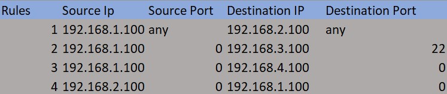
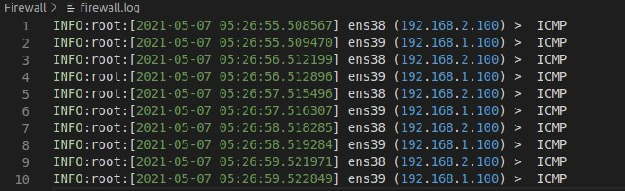
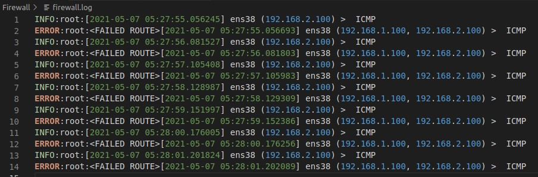
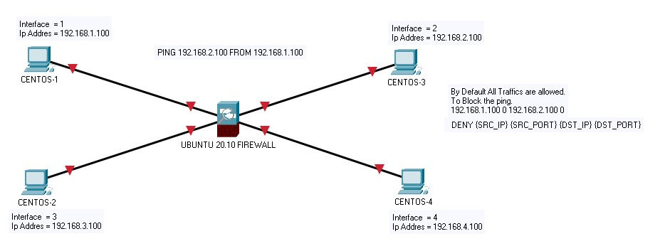

# Python firewall
Python based Packet Filtering Firewall Application.

Packet filtering is a firewall technique used to control network access by monitoring outgoing and incoming packets and allowing them to pass or halt based on the source and destination Internet Protocol (IP) addresses, protocols and ports 

# Firewall rules

Firewalls are configured using simple `if then` rules. In a packet filtering firewall, a rule says: ``if a pattern based on packet source, destination, protocol, or service is a match THEN take the specified action``. Since there are many rules involved, the order of the rules matters. <b>A LOT!<b>

Traffic is verified against a rules table in order, ``top to bottom``. Therefore, you must be careful as to how you define your rules and in which order should you place them. Its best to begin very strict and lay off as you go down the table.

**Rule Syntax**

By default all the traffic allowed!. Empty File makes DEFAULT ALLOWS TRAFFIC.   
``DENY <SRC_IP> <SRC_PORT> <DST_IP> <DST_PORT>``  
``192.168.1.100 0 192.168.2.100 0``  
Deny packet Based on Source 192.168.1.100:0 to Destination 192.168.2.100:0  

**Rule File**

We'll use a [CSV](./imports/Rules.csv) file as our rules table.

# Firewall Log

The logging feature documents how the firewall deals with traffic types.
All the logs will be saved in a [Log file](firewall.log)

**Allow Traffic Logs**

**Deny Traffic Logs**

# How this firewall works?

Basically, This firewall auto detects the interfaces which has attached and then listen to each and every interfaces using the threading module. Interfaces are running on threads to receive and send traffic simultaneously. 

## EXAMPLE
Machines used for testing :
    UBUNTU 20.10 - THE FIREWALL LISTEING IN INTERFACES 

| Interfaces    | Ip Address                                                         |
| :------------ |:-----------------------------------------------------------------: | 
| 1             | `192.168.1.0/24`                                                   |
| 2             | `192.168.2.0/24`                                                   |
| 3             | `192.168.3.0/24`                                                   |
| 4             | `192.168.4.0/24`                                                   |

    Interface 1 CENTOS CORE - 192.168.1.100 Static Ip
    Interface 2 CENTOS CORE - 192.168.2.100 Static Ip
    Interface 3 CENTOS CORE - 192.168.3.100 Static Ip
    Interface 4 CENTOS CORE - 192.168.4.100 Static Ip
I used **UBUNTU 20.10** has my firewall and added 4 interfaces.The 4 interfaces are running on CENT OS LINUX with specified ip addresses.   

If i ping from 192.168.1.100 to 192.168.2.100  
The 192.168.1.100 sends a packet from interface 1 and the firewall(ubuntu) will unpack the ip header and check for the destination ip address and forward it to the specific Interface. I have disabled the default ip forwarding in my **UBUNTU MACHINE** using 'sysctl -w net.all.forwarding = 0'. 
**Concept**

# How to run?
1. Runing the script is simple, you must have root privelages. Run the `main.py` file to begin the firewall. 
2. Requirements to run this Firewall.

&nbsp;&nbsp;&nbsp;&nbsp;&nbsp;&nbsp; - Python 3.9.2    
&nbsp;&nbsp;&nbsp;&nbsp;&nbsp;&nbsp; - Ubuntu 20.10 Virtual Machine.     
&nbsp;&nbsp;&nbsp;&nbsp;&nbsp;&nbsp; - Four Interfaces with IP configured.       
3. Dependencies.      

&nbsp;&nbsp;&nbsp;&nbsp;&nbsp;&nbsp; - pip3 install psutil     
&nbsp;&nbsp;&nbsp;&nbsp;&nbsp;&nbsp; - pip3 install csv     
&nbsp;&nbsp;&nbsp;&nbsp;&nbsp;&nbsp; - pip3 install threading     
&nbsp;&nbsp;&nbsp;&nbsp;&nbsp;&nbsp; - pip3 install logging     
&nbsp;&nbsp;&nbsp;&nbsp;&nbsp;&nbsp; - pip3 install datetime     

 
